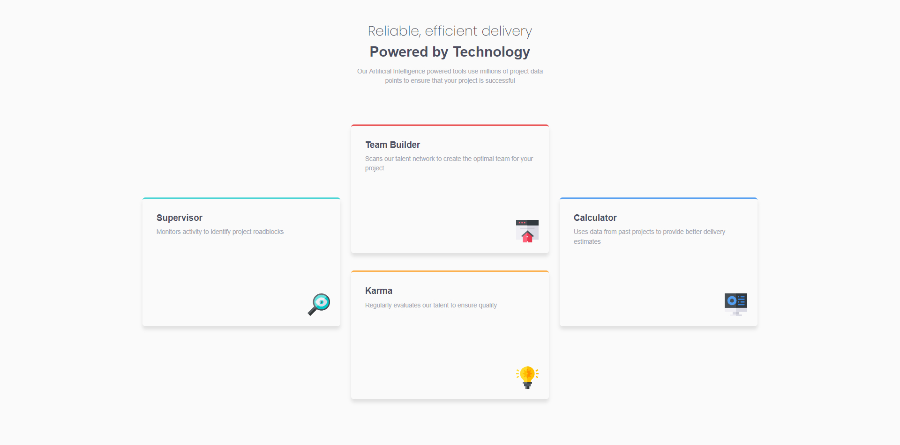

# Frontend Mentor - Product preview card component solution

This is a solution to the [Four card feature section challenge on Frontend Mentor](https://www.frontendmentor.io/challenges/four-card-feature-section-weK1eFYK). Frontend Mentor challenges help you improve your coding skills by building realistic projects. 

## Table of contents

- [Overview](#overview)
  - [The challenge](#the-challenge)
  - [Screenshot](#screenshot)
  - [Links](#links)
- [My process](#my-process)
  - [Built with](#built-with)
- [Author](#author)

## Overview

### The challenge

Users should be able to:

- View the optimal layout depending on their device's screen size

### Screenshot

Desktop:

### Links

- Solution URL: [Solution](https://your-solution-url.com)
- Live Site URL: [Live site](https://lazur05.github.io/frontend-mentor/6.%20Four%20card%20feature%20section/)

## My process

### Built with

- Semantic HTML5 markup
- CSS custom properties
- CSS Grid
- Mobile-first workflow
- [SASS](https://sass-lang.com/) - SASS Preprocessor

## Author

- Frontend Mentor - [@Lazur05](https://www.frontendmentor.io/profile/Lazur05)
- X - [@Lazur05_](https://x.com/Lazur05_)
